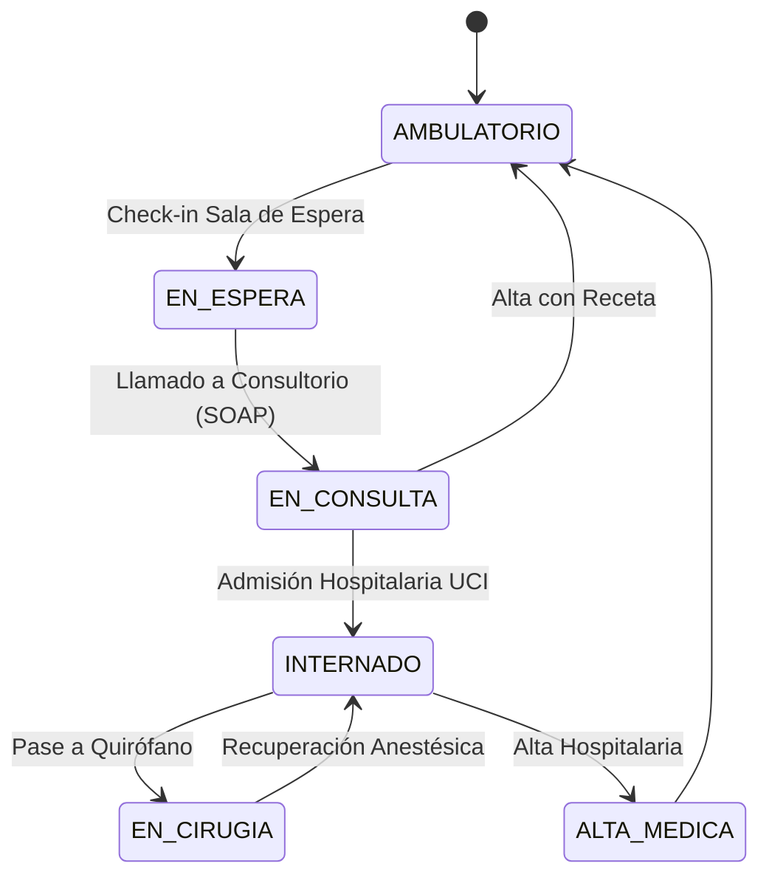

# 04. Modelo de Datos y Máquinas de Estados

---

## 1. Estados de Pacientes & Transiciones

## 2. Invariantes Clínicos
1. **Unicidad de Cama UCI:** Un canil o cama de internación no puede tener dos pacientes con estado `ACTIVA` simultáneamente.
2. **Inmutabilidad SOAP:** Una consulta firmada por un veterinario no puede ser sobrescrita; correcciones se realizan vía Addendum fechado y firmado.
3. **Idempotencia en Cobros:** Toda transacción de cobro de insumos debe contar con identificador único de operación para prevenir doble facturación.
