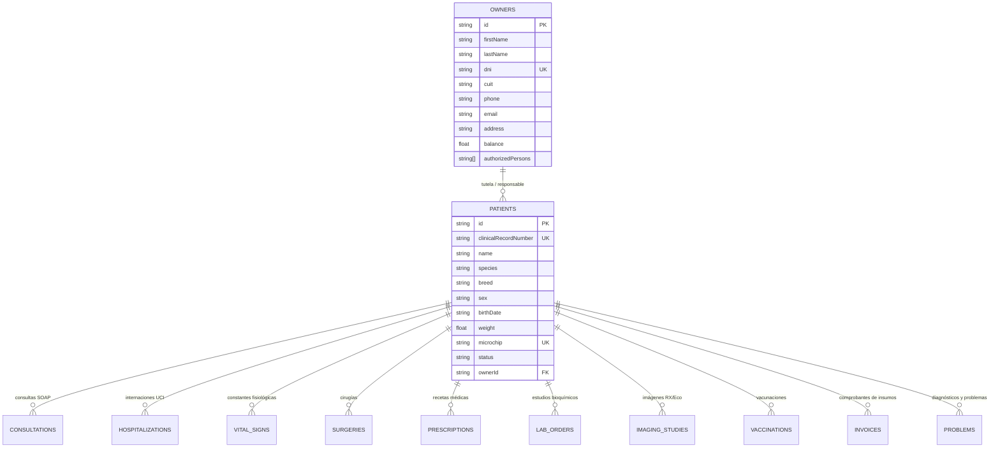

# Modelo de Datos & Entidades — Pacientes & Tutores

---

## 1. Esquema Relacional de Entidades

## 2. Invariantes del Dominio
- **Microchip Único:** Si el microchip está presente, debe ser único en la organización.
- **Fecha y Edad:** La edad se calcula dinámicamente desde `birthDate` en tiempo de renderizado.
- **Auditoría Append-Only:** Todo cambio en la ficha del paciente se registra con autor y timestamp UTC.
